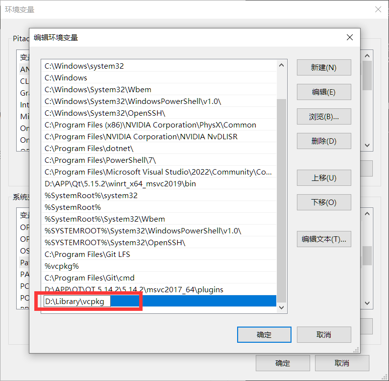

# 三维水印QT版本模板项目

# 环境配置

依然vcpkg作为包管理器

1. 添加vcpkg到环境变量，确保在其他地方能访问到vcpkg.exe
    
    有三个需要的第三方库：assimp,fmt,qt5
    
    
    
2. 修改CMakeLists.txt文件中的vcpkg位置为自己的安装位置
    
    ```bash
    set(CMAKE_TOOLCHAIN_FILE "[VCPKG安装的根目录]/scripts/buildsystems/vcpkg.cmake")
    ```
    
    例如
    
    `set(CMAKE_TOOLCHAIN_FILE "D:/Library/vcpkg/scripts/buildsystems/vcpkg.cmake")`
    
3. 调用安装脚本，安装需要的包，下面的是在终端执行的代码，也可以直接双击运行
    
    ```bash
    .\install_packages.bat
    ```
    
    输出如下信息表示安装完成：
    
    ```bash
    Total install time: 301 us
    assimp provides CMake targets:
    
        # this is heuristically generated, and may not be correct
        find_package(assimp CONFIG REQUIRED)
        target_link_libraries(main PRIVATE assimp::assimp)
    
    The package fmt provides CMake targets:
    
        find_package(fmt CONFIG REQUIRED)
        target_link_libraries(main PRIVATE fmt::fmt)
    
        # Or use the header-only version
        find_package(fmt CONFIG REQUIRED)
        target_link_libraries(main PRIVATE fmt::fmt-header-only)
    
    Applied user-wide integration for this vcpkg root.
    CMake projects should use: "-DCMAKE_TOOLCHAIN_FILE=D:/Library/vcpkg/scripts/buildsystems/vcpkg.cmake"
    
    All MSBuild C++ projects can now #include any installed libraries. Linking will be handled automatically. Installing new libraries will make them instantly available.
    ```
    
4. 调用构建脚本，编译工程文件到build目录中，正常构建会自动打开工程。工程文件为build/Watermark3D.sln，下面的是在终端执行的代码，也可以直接双击运行
    
    ```bash
    ./build.bat
    ```
    
5. 编译并运行代码，会出现如图所示的窗口
    
    
    
    # 程序功能
    
    ## 按钮
    
    1. `创建矩形按钮`会在随机位置创建一个带纹理的矩形对象
    2. `清空矩形按钮`会清空场景中所有矩形对象
    
    ## 键鼠操控
    
    - `W`: 摄像机前进
    - `A`: 摄像机左移
    - `S`: 摄像机后退
    - `D`: 摄像机右移
    - `Q`: 摄像机上升
    - `E`: 摄像机下降
    - `G`: 摄像机复位，回到默认位置
    - `鼠标移动`: 需要先按住左键或右键，拖动鼠标控制镜头方向
    - `鼠标滚轮`: 调整摄像机视野
    
    # 目录说明
    
    - `src` 源码目录
    - `ui` qt的ui文件目录
    - `shader` shdaer源码目录
    - `resources` 纹理等资源目录
    - `doc` Readme的图片资源目录
    - `build` cmake自动生成的项目目录，不包含在git仓库中
    - `bin` 编译程序自动生成的可执行程序目录，不包含在git仓库中